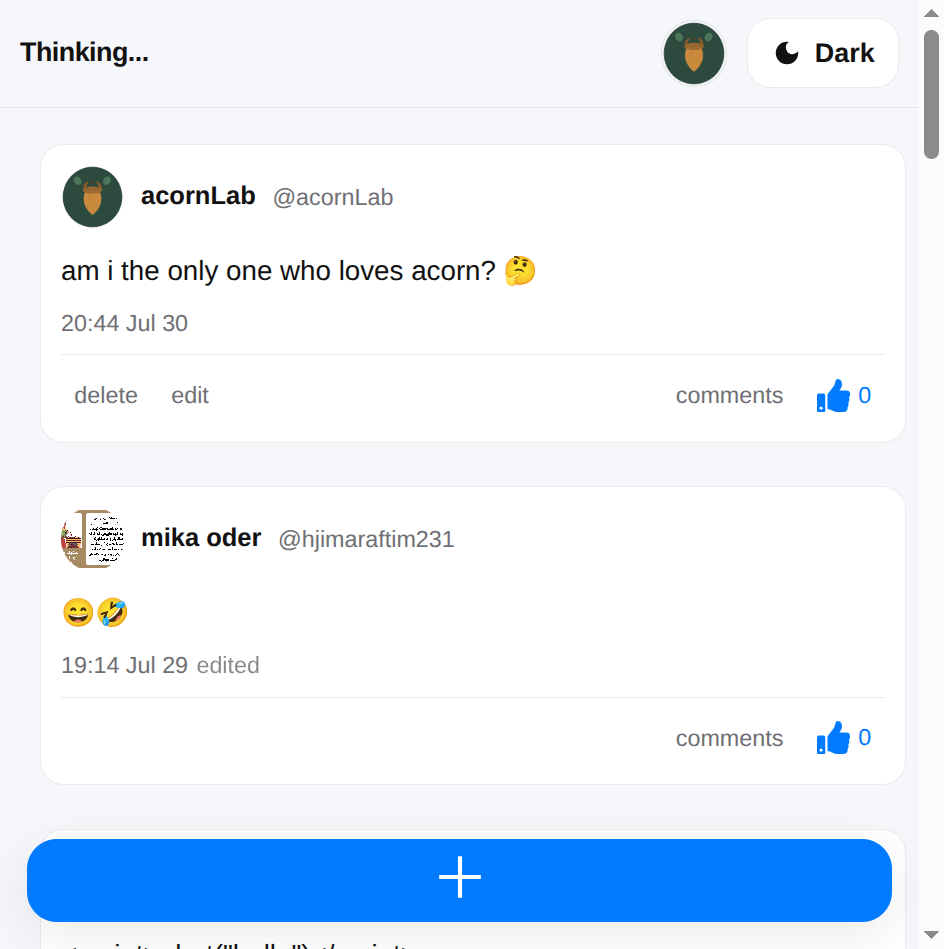
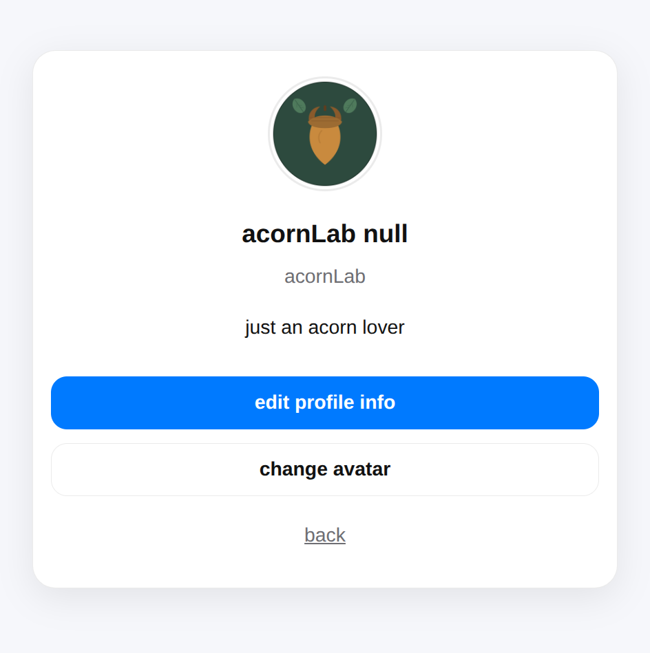
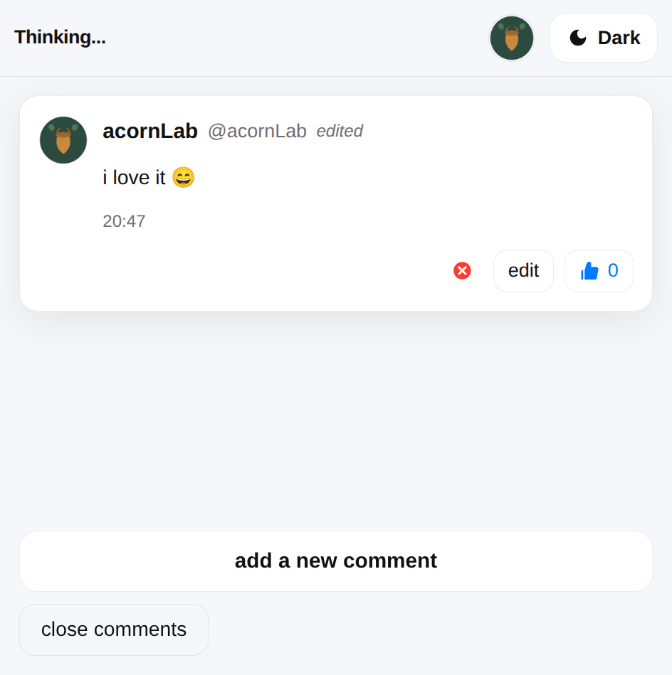
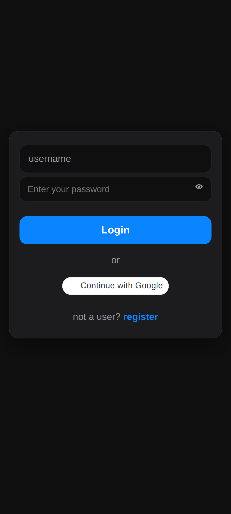
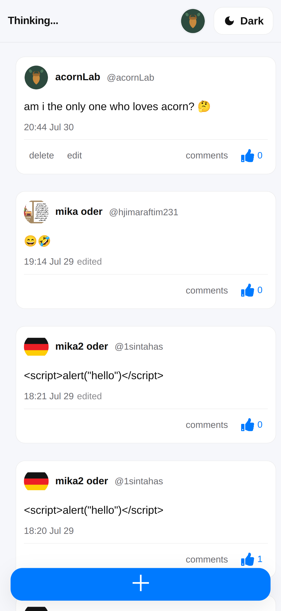

# Acorn Lab 🌰


A full-stack social platform built with React, Express, PostgreSQL, and modern security practices.

## Overview

Acorn Lab is a secure full-stack social platform that allows users to create, manage, and discuss thoughts in real time.

The project was built to demonstrate modern full-stack development practices, including secure JWT authentication, refresh token rotation, real-time communication with Socket.IO, cloud file storage using AWS S3, and scalable PostgreSQL-based architecture.

Its primary goal is to showcase production-oriented backend design rather than simply implementing a CRUD application.

## Features

- Secure user authentication and authorization
- JWT access token and refresh token authentication
- Refresh token rotation with secure database storage
- HTTP-only cookie-based authentication
- Secure password hashing using bcrypt
- Protected API routes
- User profile management
- Avatar upload with AWS S3
- Real-time comments powered by Socket.IO
- PostgreSQL relational database
- Dark mode support
- Rate limiting against brute-force attacks
- Security middleware with Helmet
- Input validation and secure backend architecture

## Tech Stack

### Frontend

- React
- Vite
- JavaScript
- CSS Modules
- Axios
- React Router
- Lucide React

### Backend

- Node.js
- Express
- PostgreSQL
- Socket.IO

### Security

- JWT authentication
- HTTP-only cookies
- bcrypt password hashing
- Helmet security middleware
- Express Rate Limit

## Architecture

```text
                React + Vite
                      │
                  Axios API
                      │
               Express Backend
          ┌───────────┴───────────┐
          │                       │
     PostgreSQL              Socket.IO
          │                       │
     User Data             Real-time Events
          │
        AWS S3
     Avatar Storage
```

## Installation

### Prerequisites

- Node.js 18+
- PostgreSQL

### Clone the repository

```bash
git clone https://github.com/acornCore-2000/acorn-lab.git
cd acorn-lab
```

### Install frontend dependencies

```bash
npm install
```

### Install backend dependencies

```bash
cd backend
npm install
cd ..
```

### Configure PostgreSQL

1. Create a PostgreSQL database in pgAdmin.

2. Copy the backend environment file:

```bash
cp backend/.env.example backend/.env
```

3. Update `backend/.env` with your database and service credentials:

```env
DB_USER=postgres
DB_PASSWORD=YOUR_PASSWORD
DB_HOST=localhost
DB_PORT=5432
DB_NAME=YOUR_DATABASE_NAME

JWT_ACCESS_SECRET=YOUR_ACCESS_SECRET
JWT_REFRESH_SECRET=YOUR_REFRESH_SECRET

S3_BUCKET_NAME=YOUR_S3_BUCKET
S3_ENDPOINT=YOUR_S3_ENDPOINT
S3_ACCESS_KEY=YOUR_S3_ACCESS_KEY
S3_SECRET_KEY=YOUR_S3_SECRET_KEY

MAILERSEND_API_KEY=YOUR_MAILERSEND_API_KEY
GOOGLE_CLIENT_ID=YOUR_GOOGLE_CLIENT_ID
GOOGLE_CLIENT_SECRET=YOUR_GOOGLE_CLIENT_SECRET
```

4. Apply the database schema from the project root:

```bash
psql -U postgres -d YOUR_DATABASE_NAME -f backend/db/schema.sql
```

### Configure frontend environment variables

```bash
cp .env.example .env
```

Update `.env`:

```env
VITE_API_URL=http://localhost:5000
VITE_GOOGLE_CLIENT_ID=YOUR_GOOGLE_CLIENT_ID
```

### Run the application

Start the frontend from the project root:

```bash
npm run dev
```

Open a new terminal and start the backend:

```bash
cd backend
npm run start
```

## Screenshots

<p align="center">
  <a href="screenshots/posts.png">
    
  </a>
  <a href="screenshots/profile.png">
    
  </a>
  <a href="screenshots/comment-section.png">
    
  </a>
  <a href="screenshots/login-page.png">
    
  </a>
  <a href="screenshots/mobile-view.png">
    
  </a>
</p>

<p align="center">
  Click an image to view it in full size.
</p>
### Posts


### Profile


### Comments


### Login


### Mobile View


## Future Improvements

- More advanced user interactions
- Improved testing coverage
- Additional performance optimizations

## License

This project is available under the MIT License.
